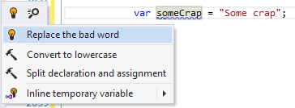

**What you should know beforehand:**
* [PSI](/HowTo/NavigateCode/NavigateCode.md#psi-basics)
* [Code analyzer](/HowTo/AnalyzeCode/AnalyzeCodeOnTheFly.md)

**Examples ([?](/HowTo/HowTo.md#sample-solution)):**
* [CorrectBadWordQuickFix.cs](https://github.com/JetBrains/sample-resharper-plugin/blob/master/SampleReSharperPlugin/src/QuickFix/CorrectBadWordQuickFix.cs)

The main difference between a context action and a quick-fix is that the latter appears only in response to a highlighting. Thus, quick-fixes are used to fix a problem that was found and highlighted by a particular code analyzer. 



For example, let's create a simple quick-fix that reacts to the warning provided by the analyzer from [Analyze Code on the Fly](/HowTo/AnalyzeCode/AnalyzeCodeOnTheFly.md) and suggests to replace the "Crap" word occurrence with "BadWord".

```csharp
[QuickFix]
public class CorrectBadWordQuickFix : QuickFixBase
{
    private readonly IVariableDeclaration _variableDeclaration;
 
    public CorrectBadWordQuickFix([NotNull] BadWordNamingWarning warning)
    {
        _variableDeclaration = warning.VariableDeclaration;
    }
  
  
    protected override Action<ITextControl> ExecutePsiTransaction(ISolution solution, IProgressIndicator progress)
    {
        return textControl =>
        {
            var newText = Regex.Replace(_variableDeclaration.DeclaredName, "crap", "BadWord", RegexOptions.IgnoreCase);
             
            RenameRefactoringService.Rename(solution,
                new RenameDataProvider((IDeclaredElement) _variableDeclaration, newText), textControl);
        };
    }
  
    public override string Text => "Replace the bad word";
    
    public override bool IsAvailable(IUserDataHolder cache)
    {
        return _variableDeclaration.IsValid();
    }
}
```

## Notes
* The easiest way to create a quick-fix is to inherit from the `QuickFixBase` class.
* The quick-fix class must be marked with the `QuickFix` attribute.
* The `BadWordNamingWarning` warning highlighting object passed to the constructor is used to obtain a particular code element that should be fixed (the code element that is highlighted by a particular highlighting).
* The `Text` property defines the text that will be shown in the actions list.
* `IsAvailable` is used to check whether the quick-fix action is available for the current caret position.
* `ExecutePsiTransaction` returns the action that is executed when the quick-fix is selected.
* Note that we use `RenameRefactoringService` to change variable's name. The service performs seamless renaming of a variable everywhere in the code.
