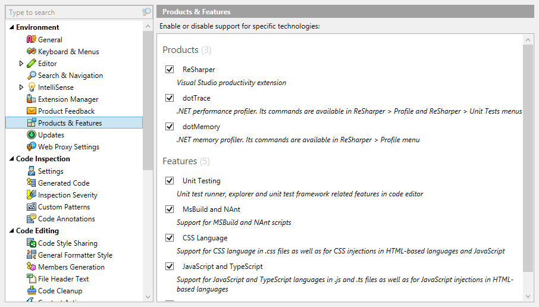

# Features and Products

## Features

Since all components in the Component Model are now grouped into zones, it is possible to treat a zone as a feature, and allow the user to disable that feature, by removing the zone's components from the Component Model's container. However, not all zones should be features, some zones are clearly implementation details, while others are integral to the product and shouldn't be disabled.

ReSharper supports this for specific zone definitions. The Features page on the options dialog lists products and features that can be disabled.



This list is populated by applying the `ZoneDefinitionConfigurableFeatureAttribute` to a zone definition. It takes three settings - the name of the feature, a short description, and a flag to state if the zone definition should be treated as a feature or a product.

```cs
[ZoneDefinition]
[ZoneDefinitionConfigurableFeature("CSS Language", "Support for CSS language in .css and HTML based files", false)]
public interface ILanguageCssZone : IPsiLanguageZone, IRequire<ILanguageHtmlZone>
{
}
```

These properties are only used by the UI. When the zone is disabled, the zone definition type's short name is saved to settings. If a feature zone has dependents (that is, other zones that depend on the feature zone), those dependent zones (and therefore features) are also disabled. For example, disabling the HTML zone will also disable the CSS zone. The dependent zone definition's short name is also written to settings.

Disabling a zone requires Visual Studio to be restarted, as all Visual Studio integration requires static registration (e.g. assemblies are registered as MEF exports, and actions are registered as static Visual Studio commands).

## Products

A zone definition can be treated as a product by passing `true` to the `isInProductSection` parameter of `ZoneDefinitionConfigurableFeatureAttribute`. The difference here is purely cosmetic. By setting this parameter to `true`, the options dialog page displays the zone in the "Products" section rather than the "Features" section. The intention of this flag is to allow the hierarchical nature of zones to be used to provide an obvious "off switch" to the user in order to disable all of the features in a product. By disabling a product zone, all dependent zones are also disabled.

### Product information

A product can also expose product information to the ReSharper Platform, by using the `ZoneDefinitionProductAttribute`. It is simply an informational attribute, used to inform the user of the name of the installed product, the company responsible and to provide links to product web pages.

```cs
[ZoneDefinition]
[ZoneDefinitionProduct(CompanyName = "JetBrains", CompanyNameLegal = "JetBrains s.r.o.", 
  ProductPresentableName = "ReSharper", ProductTechnicalName = "ReSharper",
  ProductUrl = "http://www.jetbrains.com/resharper",
  ProductIcon = typeof(ReSharperUIThemedIcons.ReSharper16x16))]
public class IReSharperProductZone : IZone
{
}
```

